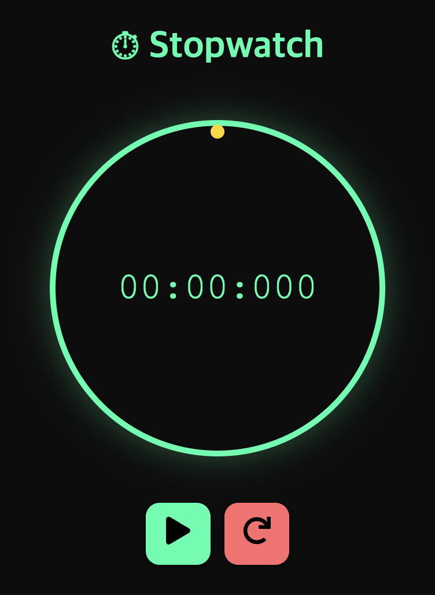
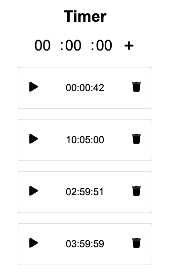

# Simple Timer & Stopwatch Mini-Project

<div style="display: flex; gap: 20px; align-items: flex-start">
  
  
</div>

This project is a **full-stack** application that provides simple timer and stopwatch functionalities using **React** (front-end) and **Spring** (back-end).
It also integrates **MongoDB** to manage data in a flexible way, allowing you to easily adapt to schema changes.

---

## 1. Tech Stack

- **Front-end**: [React](https://reactjs.org/)
- **Back-end**: [Spring Boot](https://spring.io/projects/spring-boot)
- **Database**: [MongoDB](https://www.mongodb.com/)
- **Styling**: [Styled Components](https://styled-components.com/)

---

## 2. Why MongoDB?

This project is designed to serve as a **template**, so you can conveniently modify data schemas.  
MongoDB’s flexible document structure makes it easy to adapt your schema without extensive migrations.  
However, **if you require relational models**, you can adapt this project to use **JPA** with a relational database (e.g., MySQL, PostgreSQL) instead of MongoDB.

---

## 3. Purpose

1. **Practice Full-Stack Development**: This mini-project allows you to experience the full process—front-end, back-end, and database integration.
2. **Learn API Communication**: Understand how to make HTTP requests (GET, POST, etc.) to a Spring-based back-end from a React application.
3. **Handle CORS**: If you have faced CORS issues in the past, the configurations in this project might serve as a good reference.

---

## 4. Main Features

- **Timer & Stopwatch**: Start, pause, and reset functionalities.
- **API Communication**: Data is persisted and retrieved through RESTful endpoints.
- **MongoDB Integration**: Time records and other data can be easily stored and modified.
- **Styled Components**: All UI elements are styled for clarity and maintainability.

---

## 5. Suggested Usage

- **Extend with More Components**: Feel free to add additional UI or features—such as laps, history tracking, or user authentication.
- **Customize the Styles**: Tweak the theme, colors, or animations to make it your own.
- **Experiment with CORS Config**: Review the CORS settings to learn how to handle cross-origin requests between React and Spring.

---

## 6. Getting Started

1. **Install Front-End Dependencies**
2. Install Back-End Dependencies
3. Run MongoDB

- Make sure you have a running MongoDB instance (local or remote).

```bash
# 1. Update package index (Debian/Ubuntu)
sudo apt-get update

# 2. Install MongoDB (Debian/Ubuntu)
sudo apt-get install -y mongodb

# 3. Start MongoDB service
sudo systemctl start mongodb

# 4. Enable MongoDB to start on boot
sudo systemctl enable mongodb

# 5. Check if MongoDB is running
sudo systemctl status mongodb

# 6. Connect to the MongoDB shell
mongo

```

---

## 7. Contributing

Contributions are welcome! Please fork the repository and open a pull request if you have suggestions or improvements.
