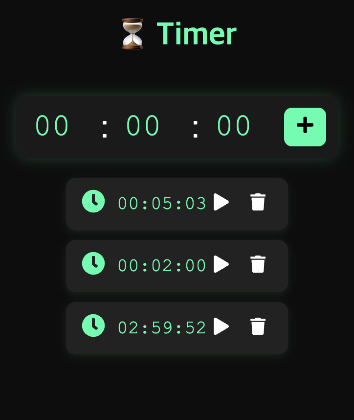

# Simple Timer & Stopwatch Mini-Project

  
  

This project is a **full-stack** application that provides simple timer and stopwatch functionalities using **React** (front-end) and **Spring** (back-end).
It also integrates **MongoDB** to manage data in a flexible way, allowing you to easily adapt to schema changes.

---

## 1. Tech Stack

- **Front-end**:
  - [React](https://reactjs.org/)
  - etc. axios, styled-components, react-icons, zustand
- **Back-end**
  - [Spring Boot](https://spring.io/projects/spring-boot)
  - etc. spring data mongodb,lombok
- **Database**
  - [MongoDB](https://www.mongodb.com/)

---

## 2. Purpose

1. **Practice Full-Stack Development**: This mini-project allows you to experience the full process—front-end, back-end, and database integration.
2. **Learn API Communication**: Understand how to make HTTP requests (GET, POST, etc.) to a Spring-based back-end from a React application.
3. **Handle CORS**: If you have faced CORS issues in the past, the configurations in this project might serve as a good reference.

---

## 3. Main Features

- **Timer & Stopwatch**: Start, pause, and reset functionalities.
- **API Communication**: Data is persisted and retrieved through RESTful endpoints.
- **MongoDB Integration**: Time records and other data can be easily stored and modified.
- **Styled Components**: All UI elements are styled for clarity and maintainability.

---

## 4. Why MongoDB?

This project is designed to serve as a **template**, so you can conveniently modify data schemas.  
MongoDB’s flexible document structure makes it easy to adapt your schema without extensive migrations.  
However, **if you require relational models**, you can adapt this project to use **JPA** with a relational database (e.g., MySQL, PostgreSQL) instead of MongoDB.

---

## 5. Suggested Usage

- **Extend with More Components**: Feel free to add additional UI or features—such as laps, history tracking, or user authentication.
- **Customize the Styles**: Tweak the theme, colors, or animations to make it your own.
- **Experiment with CORS Config**: Review the CORS settings to learn how to handle cross-origin requests between React and Spring.

---

## 6. Getting Started

1. First, move to sh folder using `cd timer/sh` and start the mongoDB `./start_mongo.sh`
  1. If the access is denied, use `chmod +x ./start_mongo.sh` and run the command `./start_mongo.sh` again.
2. To run the application, click "Run Timer" from the menu bar in the top right.
  1. Alternatively, you can start the server and client directly in the terminal.
  2. go to `timer/back` and run the server background using `nohup ./gradlew bootRun > app.log 2>&1 &`
  3. got o `../front` and run the client background using `pm2 start "npm run dev" --name timer-front`
3. It there's an dependency error in your front application. run `npm i` to install the dependencies.

